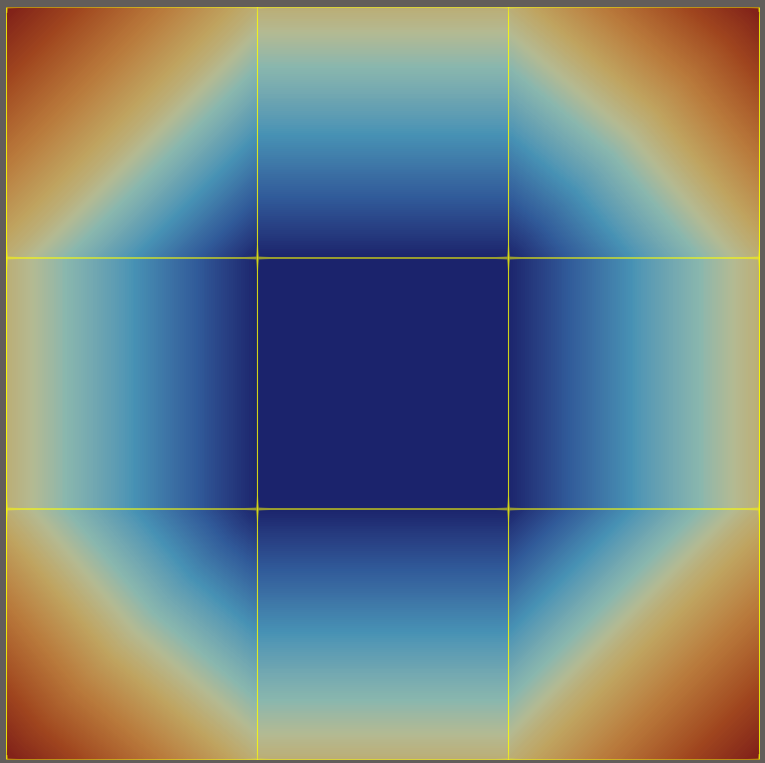
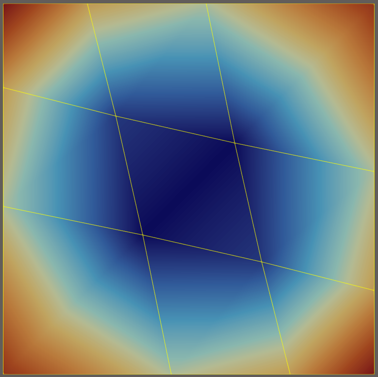
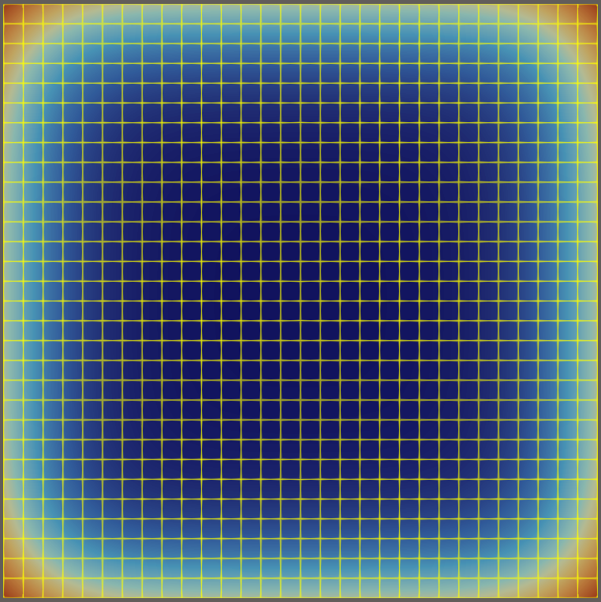
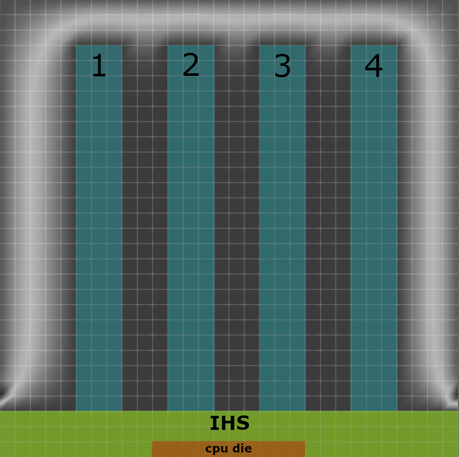
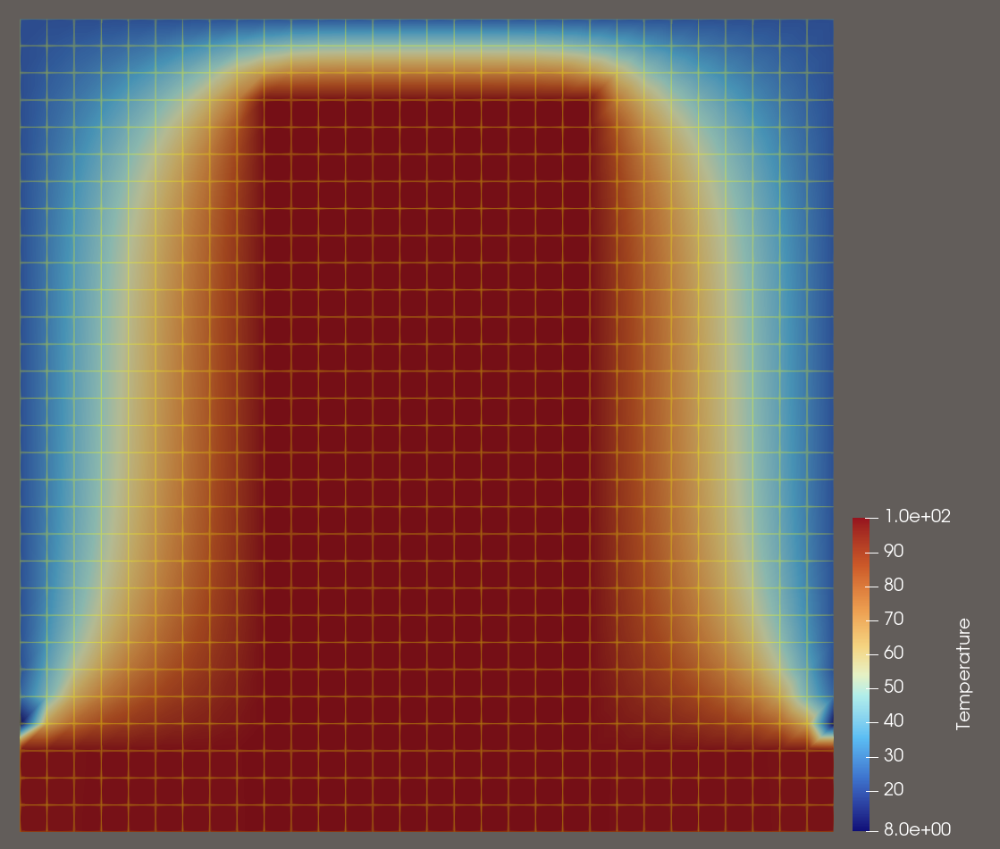
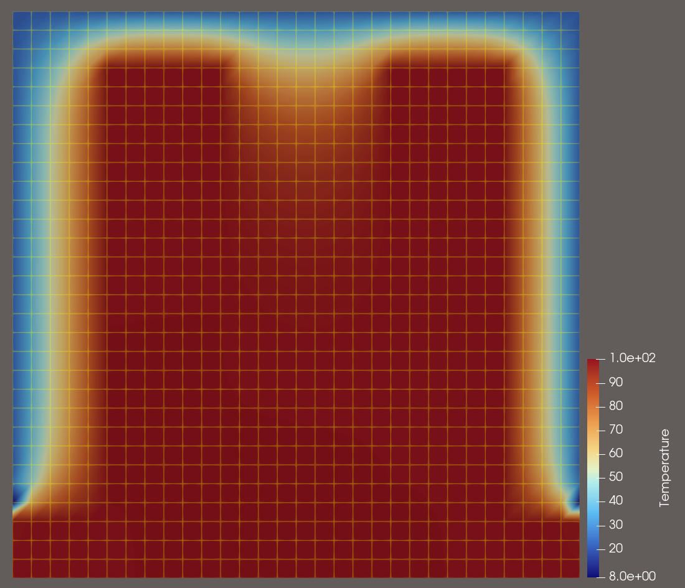
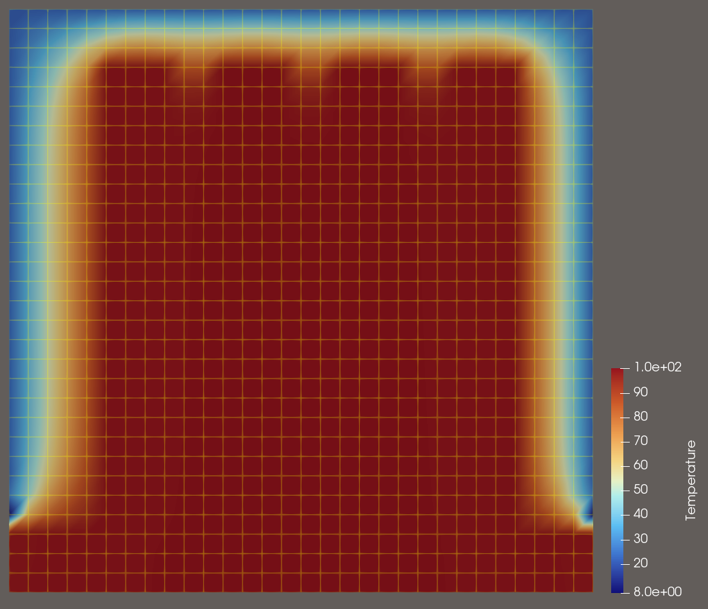

# AGH Labs Finite Element Method (FEM)

[> Wersja polska](./README.PL.md) 

2D FEM program for simulating thermal processes, developed for educational purposes during the FEM course at AGH
The basic version of the program (`mes.cpp`) allows simulation of both steady-state and transient processes for a single material type with specified boundary conditions.

The extended version (`mes_real.cpp`) for a real-world problem enhances the program by enabling the addition of a second material, inclusion of a heat source, and application of artificial diffusion*.

*Artificial diffusion* – averaging the temperature at each simulation step within a specified volume. In the considered real-world problem, this means averaging the temperature over the entire air volume in the FEM mesh.

The program saves simulation data to `.pvd` / `.vtu` files, allowing the simulation to be analyzed over time and visualized.

For transient simulations, the program stops when either the maximum temperature is reached or the process becomes steady (i.e., the change in maximum temperature between simulation steps falls below a specified epsilon).

### Temperature distributions for the steady-state process in test meshes (basic version of the program) together with the mesh schematics.

<div style="display: flex; justify-content: center; gap: 10px;">
  
  
  
</div>

### Grid data file format (with definitions and examples for more complex values)
```
SimulationTime <simulation time in seconds>
SimulationStepTime <simulation time step in seconds>
Conductivity <material conductivity>
Alfa <convective heat transfer coefficient>
Tot <ambient temperature>
InitialTemp <initial material temperature>
Density <material density>
SpecificHeat <material specific heat>
Nodes_number <number of nodes in fem grid>
Elements_number <number of elements in grid>
*Node
<node id (1...)>, <node x cord.>, <node y cord.>
      1,  0.100000001, 0.00499999989
                    ...
     16,           0., -0.0949999988
*Element, type=DC2D4
<element id (1...)>, <node id>, <node id>, <node id>, <node id>
 1,  1,  2,  6,  5
        ...
 9, 11, 12, 16, 15
*BC
<nodes ids separated with comma (,) - edges with boundary condition>
1, 2, ... 15, 16
```

### Real Problem Material Properties and Configuration
Because of a fast and somewhat messy approach to solving the real-world problem, the material properties are hard-coded, as shown below (simplified version).

``` cpp
const double COPPER_CONDUCTIVITY = 394.85;
const double COPPER_DENSITY = 8911.47;
const double COPPER_SPECIFIC_HEAT = 384.37;
...
const std::vector<int> COPPER_ELEMENTS_2 = {95,96 ... 900};
const std::vector<int> COPPER_ELEMENTS_1 = {100,101, ... 900};

const std::vector<int> INITIAL_HOT_ELEMENTS = {881,882 ... 890};
```

### Description of the Real-World Problem

The real-world problem involves performing a simulation of a CPU heatsink. The objective is to compare temperatures (max, min, avg) depending on the number of fins, as well as to compare simulations for the steady-state process, the transient process, and the transient process with artificial diffusion.



The simulation is performed on a 30×30 (elements) mesh. Despite the theoretical distinction between fins, IHS, and CPU die, all these components are modeled simply as copper material.
The mesh elements corresponding to the CPU die have an assigned heat source.

The mesh is scaled so that the dimensions of the CPU die and the IHS are as close as possible to real-world values.
The IHS typically has dimensions of 40×40 mm, while the CPU die measures 13×13 mm.
In the simulation, the side length of a single element is 1.3 mm, resulting in a CPU die size of 13 mm and an IHS size of 39 mm.

#### Mesh schematics for 3 scenarios (1, 2, and 4 heatsink fins)
<div style="display: flex; justify-content: center; gap: 10px;">
  
  
  
</div>


#### Temperature distribution for the steady-state process
<div style="display: flex; justify-content: center; gap: 10px;">
  
  
  
</div>

---

### Additional Resources

More information can be found in the report (*Polish version*):  
[Report (PDF)](./others/sprawozdanie/sprawozdanie_mes_andrzej_janaszek_16_01_2026.pdf)  

Or directly at: `./others/sprawozdanie/sprawozdanie_mes_andrzej_janaszek_16_01_2026.pdf`